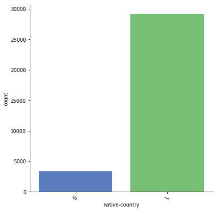

This Notebook, I will be analysing the dataset provided in an attempt to better undestand it, and see where we can transform it in order to have the best possible result.


```python
import pandas as pd
import sklearn.metrics
import numpy as np
import seaborn as sns
import matplotlib.pyplot as plt


def get_data(subset='train'):
    # Construct the data URL.
    csv_url = 'http://mlr.cs.umass.edu/ml/machine-learning-databases/'
    csv_url += f'adult/adult.{"data" if subset == "train" else "test"}'
    # Define the column names.
    names = [
        'age', 'workclass', 'fnlwgt', 'education', 'education-num',
        'marital-status', 'occupation', 'relationship', 'race', 'sex',
        'capital-gain', 'capital-loss', 'hours-per-week', 'native-country',
        'earns_over_50K']
    # Read the CSV.
    print(f'Downloading {subset} dataset to __data__/ ...')
    df = pd.read_csv(
        csv_url,
        sep=', ',
        names=names,
        skiprows=int(subset == 'test'),
        na_values='?')
    # Split into feature matrix X and labels y.
    df.earns_over_50K = df.earns_over_50K.str.contains('>').astype(int)
    X, y, full = df.drop(['earns_over_50K'], axis=1), df.earns_over_50K,df
    return X, y, full

X_train, y_train, df = get_data(subset='train')
```

    Downloading train dataset to __data__/ ...
    

    C:\Users\ngoro\Anaconda3\lib\site-packages\ipykernel_launcher.py:25: ParserWarning: Falling back to the 'python' engine because the 'c' engine does not support regex separators (separators > 1 char and different from '\s+' are interpreted as regex); you can avoid this warning by specifying engine='python'.
    

The data set is made of roughly 30000 individuals. Looking at the basic stats does not tell us anything yet. We will look at the distributions of to get a better idea of what to do next


```python
df.describe()
```


<div>
<style>
    .dataframe thead tr:only-child th {
        text-align: right;
    }

    .dataframe thead th {
        text-align: left;
    }

    .dataframe tbody tr th {
        vertical-align: top;
    }
</style>
<table border="1" class="dataframe">
  <thead>
    <tr style="text-align: right;">
      <th></th>
      <th>age</th>
      <th>fnlwgt</th>
      <th>education-num</th>
      <th>capital-gain</th>
      <th>capital-loss</th>
      <th>hours-per-week</th>
      <th>earns_over_50K</th>
    </tr>
  </thead>
  <tbody>
    <tr>
      <th>count</th>
      <td>32561.000000</td>
      <td>3.256100e+04</td>
      <td>32561.000000</td>
      <td>32561.000000</td>
      <td>32561.000000</td>
      <td>32561.000000</td>
      <td>32561.000000</td>
    </tr>
    <tr>
      <th>mean</th>
      <td>38.581647</td>
      <td>1.897784e+05</td>
      <td>10.080679</td>
      <td>1077.648844</td>
      <td>87.303830</td>
      <td>40.437456</td>
      <td>0.240810</td>
    </tr>
    <tr>
      <th>std</th>
      <td>13.640433</td>
      <td>1.055500e+05</td>
      <td>2.572720</td>
      <td>7385.292085</td>
      <td>402.960219</td>
      <td>12.347429</td>
      <td>0.427581</td>
    </tr>
    <tr>
      <th>min</th>
      <td>17.000000</td>
      <td>1.228500e+04</td>
      <td>1.000000</td>
      <td>0.000000</td>
      <td>0.000000</td>
      <td>1.000000</td>
      <td>0.000000</td>
    </tr>
    <tr>
      <th>25%</th>
      <td>28.000000</td>
      <td>1.178270e+05</td>
      <td>9.000000</td>
      <td>0.000000</td>
      <td>0.000000</td>
      <td>40.000000</td>
      <td>0.000000</td>
    </tr>
    <tr>
      <th>50%</th>
      <td>37.000000</td>
      <td>1.783560e+05</td>
      <td>10.000000</td>
      <td>0.000000</td>
      <td>0.000000</td>
      <td>40.000000</td>
      <td>0.000000</td>
    </tr>
    <tr>
      <th>75%</th>
      <td>48.000000</td>
      <td>2.370510e+05</td>
      <td>12.000000</td>
      <td>0.000000</td>
      <td>0.000000</td>
      <td>45.000000</td>
      <td>0.000000</td>
    </tr>
    <tr>
      <th>max</th>
      <td>90.000000</td>
      <td>1.484705e+06</td>
      <td>16.000000</td>
      <td>99999.000000</td>
      <td>4356.000000</td>
      <td>99.000000</td>
      <td>1.000000</td>
    </tr>
  </tbody>
</table>
</div>


```python
df.head
```


    <bound method NDFrame.head of        age         workclass  fnlwgt     education  education-num  \
    0       39         State-gov   77516     Bachelors             13   
    1       50  Self-emp-not-inc   83311     Bachelors             13   
    2       38           Private  215646       HS-grad              9   
    3       53           Private  234721          11th              7   
    4       28           Private  338409     Bachelors             13   
    5       37           Private  284582       Masters             14   
    6       49           Private  160187           9th              5   
    7       52  Self-emp-not-inc  209642       HS-grad              9   
    8       31           Private   45781       Masters             14   
    9       42           Private  159449     Bachelors             13   
    10      37           Private  280464  Some-college             10   
    11      30         State-gov  141297     Bachelors             13   
    12      23           Private  122272     Bachelors             13   
    13      32           Private  205019    Assoc-acdm             12   
    14      40           Private  121772     Assoc-voc             11   
    15      34           Private  245487       7th-8th              4   
    16      25  Self-emp-not-inc  176756       HS-grad              9   
    17      32           Private  186824       HS-grad              9   
    18      38           Private   28887          11th              7   
    19      43  Self-emp-not-inc  292175       Masters             14   
    20      40           Private  193524     Doctorate             16   
    21      54           Private  302146       HS-grad              9   
    22      35       Federal-gov   76845           9th              5   
    23      43           Private  117037          11th              7   
    24      59           Private  109015       HS-grad              9   
    25      56         Local-gov  216851     Bachelors             13   
    26      19           Private  168294       HS-grad              9   
    27      54               NaN  180211  Some-college             10   
    28      39           Private  367260       HS-grad              9   
    29      49           Private  193366       HS-grad              9   
    ...    ...               ...     ...           ...            ...   
    32531   30               NaN   33811     Bachelors             13   
    32532   34           Private  204461     Doctorate             16   
    32533   54           Private  337992     Bachelors             13   
    32534   37           Private  179137  Some-college             10   
    32535   22           Private  325033          12th              8   
    32536   34           Private  160216     Bachelors             13   
    32537   30           Private  345898       HS-grad              9   
    32538   38           Private  139180     Bachelors             13   
    32539   71               NaN  287372     Doctorate             16   
    32540   45         State-gov  252208       HS-grad              9   
    32541   41               NaN  202822       HS-grad              9   
    32542   72               NaN  129912       HS-grad              9   
    32543   45         Local-gov  119199    Assoc-acdm             12   
    32544   31           Private  199655       Masters             14   
    32545   39         Local-gov  111499    Assoc-acdm             12   
    32546   37           Private  198216    Assoc-acdm             12   
    32547   43           Private  260761       HS-grad              9   
    32548   65  Self-emp-not-inc   99359   Prof-school             15   
    32549   43         State-gov  255835  Some-college             10   
    32550   43  Self-emp-not-inc   27242  Some-college             10   
    32551   32           Private   34066          10th              6   
    32552   43           Private   84661     Assoc-voc             11   
    32553   32           Private  116138       Masters             14   
    32554   53           Private  321865       Masters             14   
    32555   22           Private  310152  Some-college             10   
    32556   27           Private  257302    Assoc-acdm             12   
    32557   40           Private  154374       HS-grad              9   
    32558   58           Private  151910       HS-grad              9   
    32559   22           Private  201490       HS-grad              9   
    32560   52      Self-emp-inc  287927       HS-grad              9   
    
                  marital-status         occupation    relationship  \
    0              Never-married       Adm-clerical   Not-in-family   
    1         Married-civ-spouse    Exec-managerial         Husband   
    2                   Divorced  Handlers-cleaners   Not-in-family   
    3         Married-civ-spouse  Handlers-cleaners         Husband   
    4         Married-civ-spouse     Prof-specialty            Wife   
    5         Married-civ-spouse    Exec-managerial            Wife   
    6      Married-spouse-absent      Other-service   Not-in-family   
    7         Married-civ-spouse    Exec-managerial         Husband   
    8              Never-married     Prof-specialty   Not-in-family   
    9         Married-civ-spouse    Exec-managerial         Husband   
    10        Married-civ-spouse    Exec-managerial         Husband   
    11        Married-civ-spouse     Prof-specialty         Husband   
    12             Never-married       Adm-clerical       Own-child   
    13             Never-married              Sales   Not-in-family   
    14        Married-civ-spouse       Craft-repair         Husband   
    15        Married-civ-spouse   Transport-moving         Husband   
    16             Never-married    Farming-fishing       Own-child   
    17             Never-married  Machine-op-inspct       Unmarried   
    18        Married-civ-spouse              Sales         Husband   
    19                  Divorced    Exec-managerial       Unmarried   
    20        Married-civ-spouse     Prof-specialty         Husband   
    21                 Separated      Other-service       Unmarried   
    22        Married-civ-spouse    Farming-fishing         Husband   
    23        Married-civ-spouse   Transport-moving         Husband   
    24                  Divorced       Tech-support       Unmarried   
    25        Married-civ-spouse       Tech-support         Husband   
    26             Never-married       Craft-repair       Own-child   
    27        Married-civ-spouse                NaN         Husband   
    28                  Divorced    Exec-managerial   Not-in-family   
    29        Married-civ-spouse       Craft-repair         Husband   
    ...                      ...                ...             ...   
    32531          Never-married                NaN   Not-in-family   
    32532     Married-civ-spouse     Prof-specialty         Husband   
    32533     Married-civ-spouse    Exec-managerial         Husband   
    32534               Divorced       Adm-clerical       Unmarried   
    32535          Never-married    Protective-serv       Own-child   
    32536          Never-married    Exec-managerial   Not-in-family   
    32537          Never-married       Craft-repair   Not-in-family   
    32538               Divorced     Prof-specialty       Unmarried   
    32539     Married-civ-spouse                NaN         Husband   
    32540              Separated       Adm-clerical       Own-child   
    32541              Separated                NaN   Not-in-family   
    32542     Married-civ-spouse                NaN         Husband   
    32543               Divorced     Prof-specialty       Unmarried   
    32544               Divorced      Other-service   Not-in-family   
    32545     Married-civ-spouse       Adm-clerical            Wife   
    32546               Divorced       Tech-support   Not-in-family   
    32547     Married-civ-spouse  Machine-op-inspct         Husband   
    32548          Never-married     Prof-specialty   Not-in-family   
    32549               Divorced       Adm-clerical  Other-relative   
    32550     Married-civ-spouse       Craft-repair         Husband   
    32551     Married-civ-spouse  Handlers-cleaners         Husband   
    32552     Married-civ-spouse              Sales         Husband   
    32553          Never-married       Tech-support   Not-in-family   
    32554     Married-civ-spouse    Exec-managerial         Husband   
    32555          Never-married    Protective-serv   Not-in-family   
    32556     Married-civ-spouse       Tech-support            Wife   
    32557     Married-civ-spouse  Machine-op-inspct         Husband   
    32558                Widowed       Adm-clerical       Unmarried   
    32559          Never-married       Adm-clerical       Own-child   
    32560     Married-civ-spouse    Exec-managerial            Wife   
    
                         race     sex  capital-gain  capital-loss  hours-per-week  \
    0                   White    Male          2174             0              40   
    1                   White    Male             0             0              13   
    2                   White    Male             0             0              40   
    3                   Black    Male             0             0              40   
    4                   Black  Female             0             0              40   
    5                   White  Female             0             0              40   
    6                   Black  Female             0             0              16   
    7                   White    Male             0             0              45   
    8                   White  Female         14084             0              50   
    9                   White    Male          5178             0              40   
    10                  Black    Male             0             0              80   
    11     Asian-Pac-Islander    Male             0             0              40   
    12                  White  Female             0             0              30   
    13                  Black    Male             0             0              50   
    14     Asian-Pac-Islander    Male             0             0              40   
    15     Amer-Indian-Eskimo    Male             0             0              45   
    16                  White    Male             0             0              35   
    17                  White    Male             0             0              40   
    18                  White    Male             0             0              50   
    19                  White  Female             0             0              45   
    20                  White    Male             0             0              60   
    21                  Black  Female             0             0              20   
    22                  Black    Male             0             0              40   
    23                  White    Male             0          2042              40   
    24                  White  Female             0             0              40   
    25                  White    Male             0             0              40   
    26                  White    Male             0             0              40   
    27     Asian-Pac-Islander    Male             0             0              60   
    28                  White    Male             0             0              80   
    29                  White    Male             0             0              40   
    ...                   ...     ...           ...           ...             ...   
    32531  Asian-Pac-Islander  Female             0             0              99   
    32532               White    Male             0             0              60   
    32533  Asian-Pac-Islander    Male             0             0              50   
    32534               White  Female             0             0              39   
    32535               Black    Male             0             0              35   
    32536               White  Female             0             0              55   
    32537               Black    Male             0             0              46   
    32538               Black  Female         15020             0              45   
    32539               White    Male             0             0              10   
    32540               White  Female             0             0              40   
    32541               Black  Female             0             0              32   
    32542               White    Male             0             0              25   
    32543               White  Female             0             0              48   
    32544               Other  Female             0             0              30   
    32545               White  Female             0             0              20   
    32546               White  Female             0             0              40   
    32547               White    Male             0             0              40   
    32548               White    Male          1086             0              60   
    32549               White  Female             0             0              40   
    32550               White    Male             0             0              50   
    32551  Amer-Indian-Eskimo    Male             0             0              40   
    32552               White    Male             0             0              45   
    32553  Asian-Pac-Islander    Male             0             0              11   
    32554               White    Male             0             0              40   
    32555               White    Male             0             0              40   
    32556               White  Female             0             0              38   
    32557               White    Male             0             0              40   
    32558               White  Female             0             0              40   
    32559               White    Male             0             0              20   
    32560               White  Female         15024             0              40   
    
          native-country  earns_over_50K  
    0      United-States               0  
    1      United-States               0  
    2      United-States               0  
    3      United-States               0  
    4               Cuba               0  
    5      United-States               0  
    6            Jamaica               0  
    7      United-States               1  
    8      United-States               1  
    9      United-States               1  
    10     United-States               1  
    11             India               1  
    12     United-States               0  
    13     United-States               0  
    14               NaN               1  
    15            Mexico               0  
    16     United-States               0  
    17     United-States               0  
    18     United-States               0  
    19     United-States               1  
    20     United-States               1  
    21     United-States               0  
    22     United-States               0  
    23     United-States               0  
    24     United-States               0  
    25     United-States               1  
    26     United-States               0  
    27             South               1  
    28     United-States               0  
    29     United-States               0  
    ...              ...             ...  
    32531  United-States               0  
    32532  United-States               1  
    32533          Japan               1  
    32534  United-States               0  
    32535  United-States               0  
    32536  United-States               1  
    32537  United-States               0  
    32538  United-States               1  
    32539  United-States               1  
    32540  United-States               0  
    32541  United-States               0  
    32542  United-States               0  
    32543  United-States               0  
    32544  United-States               0  
    32545  United-States               1  
    32546  United-States               0  
    32547         Mexico               0  
    32548  United-States               0  
    32549  United-States               0  
    32550  United-States               0  
    32551  United-States               0  
    32552  United-States               0  
    32553         Taiwan               0  
    32554  United-States               1  
    32555  United-States               0  
    32556  United-States               0  
    32557  United-States               1  
    32558  United-States               0  
    32559  United-States               0  
    32560  United-States               1  
    
    [32561 rows x 15 columns]>


The data is made off 15 features. 1 predictive and 14 trainable. The prediction is going to be made over a boolean values where a positive number will be representing an individual making over 50K. It is made of 6 numeric trainable features and 7 trainable categorical features.


```python
df.columns
```


    Index(['age', 'workclass', 'fnlwgt', 'education', 'education-num',
           'marital-status', 'occupation', 'relationship', 'race', 'sex',
           'capital-gain', 'capital-loss', 'hours-per-week', 'native-country',
           'earns_over_50K'],
          dtype='object')


```python
len(list(df.columns))
```


    15


```python
len(list(df._get_numeric_data()))
```


    7


let's check the correlation between numerical variable and check if there some kind of trend going. Looking a the correlation map, we realize that there is no clear positive nor negative correlation between the income and the rest of the feature. Let's check the correlation map over all the features.


```python
numeric_train = df._get_numeric_data()
corrmatrix = numeric_train.corr()
plt.subplots(figsize=(12,9))
sns.heatmap(corrmatrix, vmax=0.9, annot= True,square=True)
plt.savefig('numeric_train_corr.png')
plt.show()

```


Before creating the heatmap we are first going to convert the categorical variable into numercial variables.


```python
import sklearn.preprocessing as preprocessing

def encode_cat_num(df):
    df_new = df.copy()
    enc = {}
    for c in df_new.columns:
        if df_new.dtypes[c] == np.object:
            enc[c] = preprocessing.LabelEncoder()
            result[c] = enc[c].fit_transform(df_new[c])
    return df_new, enc


df_enc, enc = encode_cat_num(df)
plt.subplots(figsize=(12,9))
sns.heatmap(df_enc.corr(), vmax=0.9, annot= True,square=True)
plt.show()
```


    ---------------------------------------------------------------------------

    TypeError                                 Traceback (most recent call last)

    <ipython-input-15-1dd0932f9015> in <module>()
         11 
         12 
    ---> 13 df_enc, enc = encode_cat_num(df)
         14 plt.subplots(figsize=(12,9))
         15 sns.heatmap(df_enc.corr(), vmax=0.9, annot= True,square=True)
    

    <ipython-input-15-1dd0932f9015> in encode_cat_num(df)
          7         if df_new.dtypes[c] == np.object:
          8             enc[c] = preprocessing.LabelEncoder()
    ----> 9             result[c] = enc[c].fit_transform(df_new[c])
         10     return df_new, enc
         11 
    

    ~\Anaconda3\lib\site-packages\sklearn\preprocessing\label.py in fit_transform(self, y)
        234         """
        235         y = column_or_1d(y, warn=True)
    --> 236         self.classes_, y = _encode(y, encode=True)
        237         return y
        238 
    

    ~\Anaconda3\lib\site-packages\sklearn\preprocessing\label.py in _encode(values, uniques, encode)
        106     """
        107     if values.dtype == object:
    --> 108         return _encode_python(values, uniques, encode)
        109     else:
        110         return _encode_numpy(values, uniques, encode)
    

    ~\Anaconda3\lib\site-packages\sklearn\preprocessing\label.py in _encode_python(values, uniques, encode)
         61     # only used in _encode below, see docstring there for details
         62     if uniques is None:
    ---> 63         uniques = sorted(set(values))
         64         uniques = np.array(uniques, dtype=values.dtype)
         65     if encode:
    

    TypeError: '<' not supported between instances of 'float' and 'str'


Ok looks like we have some missing values, let's check where the missing values are and what we can do about them. We have mainly Missing values in the workclass, occupation and in the native country. Why?


```python
df.isnull().sum()
```


    age                  0
    workclass         1836
    fnlwgt               0
    education            0
    education-num        0
    marital-status       0
    occupation        1843
    relationship         0
    race                 0
    sex                  0
    capital-gain         0
    capital-loss         0
    hours-per-week       0
    native-country     583
    earns_over_50K       0
    dtype: int64


looking at the factorplot below i cant help notice that there where two unused class, missing data representative of that particular class? I can replace those missing values with those unsused classes or replace them with unemployed. Using the most frequent value too may be an option. Looking at the data, I wanted to see if I could categorise the missing data based on education level. But then again, there was not existing trends, so will just replace all the empty workclass variable with the new term unemployed. The same goes with occupations variable.


```python
sns.factorplot(x="workclass",y="earns_over_50K",data=df,kind="bar", size = 6, 
palette = "muted")
plt.xticks(rotation=60);
```


```python
df
```


<div>
<style>
    .dataframe thead tr:only-child th {
        text-align: right;
    }

    .dataframe thead th {
        text-align: left;
    }

    .dataframe tbody tr th {
        vertical-align: top;
    }
</style>
<table border="1" class="dataframe">
  <thead>
    <tr style="text-align: right;">
      <th></th>
      <th>age</th>
      <th>workclass</th>
      <th>fnlwgt</th>
      <th>education</th>
      <th>education-num</th>
      <th>marital-status</th>
      <th>occupation</th>
      <th>relationship</th>
      <th>race</th>
      <th>sex</th>
      <th>capital-gain</th>
      <th>capital-loss</th>
      <th>hours-per-week</th>
      <th>native-country</th>
      <th>earns_over_50K</th>
    </tr>
  </thead>
  <tbody>
    <tr>
      <th>0</th>
      <td>39</td>
      <td>State-gov</td>
      <td>77516</td>
      <td>Bachelors</td>
      <td>13</td>
      <td>Never-married</td>
      <td>Adm-clerical</td>
      <td>Not-in-family</td>
      <td>White</td>
      <td>Male</td>
      <td>2174</td>
      <td>0</td>
      <td>40</td>
      <td>United-States</td>
      <td>0</td>
    </tr>
    <tr>
      <th>1</th>
      <td>50</td>
      <td>Self-emp-not-inc</td>
      <td>83311</td>
      <td>Bachelors</td>
      <td>13</td>
      <td>Married-civ-spouse</td>
      <td>Exec-managerial</td>
      <td>Husband</td>
      <td>White</td>
      <td>Male</td>
      <td>0</td>
      <td>0</td>
      <td>13</td>
      <td>United-States</td>
      <td>0</td>
    </tr>
    <tr>
      <th>2</th>
      <td>38</td>
      <td>Private</td>
      <td>215646</td>
      <td>HS-grad</td>
      <td>9</td>
      <td>Divorced</td>
      <td>Handlers-cleaners</td>
      <td>Not-in-family</td>
      <td>White</td>
      <td>Male</td>
      <td>0</td>
      <td>0</td>
      <td>40</td>
      <td>United-States</td>
      <td>0</td>
    </tr>
    <tr>
      <th>3</th>
      <td>53</td>
      <td>Private</td>
      <td>234721</td>
      <td>11th</td>
      <td>7</td>
      <td>Married-civ-spouse</td>
      <td>Handlers-cleaners</td>
      <td>Husband</td>
      <td>Black</td>
      <td>Male</td>
      <td>0</td>
      <td>0</td>
      <td>40</td>
      <td>United-States</td>
      <td>0</td>
    </tr>
    <tr>
      <th>4</th>
      <td>28</td>
      <td>Private</td>
      <td>338409</td>
      <td>Bachelors</td>
      <td>13</td>
      <td>Married-civ-spouse</td>
      <td>Prof-specialty</td>
      <td>Wife</td>
      <td>Black</td>
      <td>Female</td>
      <td>0</td>
      <td>0</td>
      <td>40</td>
      <td>Cuba</td>
      <td>0</td>
    </tr>
    <tr>
      <th>5</th>
      <td>37</td>
      <td>Private</td>
      <td>284582</td>
      <td>Masters</td>
      <td>14</td>
      <td>Married-civ-spouse</td>
      <td>Exec-managerial</td>
      <td>Wife</td>
      <td>White</td>
      <td>Female</td>
      <td>0</td>
      <td>0</td>
      <td>40</td>
      <td>United-States</td>
      <td>0</td>
    </tr>
    <tr>
      <th>6</th>
      <td>49</td>
      <td>Private</td>
      <td>160187</td>
      <td>9th</td>
      <td>5</td>
      <td>Married-spouse-absent</td>
      <td>Other-service</td>
      <td>Not-in-family</td>
      <td>Black</td>
      <td>Female</td>
      <td>0</td>
      <td>0</td>
      <td>16</td>
      <td>Jamaica</td>
      <td>0</td>
    </tr>
    <tr>
      <th>7</th>
      <td>52</td>
      <td>Self-emp-not-inc</td>
      <td>209642</td>
      <td>HS-grad</td>
      <td>9</td>
      <td>Married-civ-spouse</td>
      <td>Exec-managerial</td>
      <td>Husband</td>
      <td>White</td>
      <td>Male</td>
      <td>0</td>
      <td>0</td>
      <td>45</td>
      <td>United-States</td>
      <td>1</td>
    </tr>
    <tr>
      <th>8</th>
      <td>31</td>
      <td>Private</td>
      <td>45781</td>
      <td>Masters</td>
      <td>14</td>
      <td>Never-married</td>
      <td>Prof-specialty</td>
      <td>Not-in-family</td>
      <td>White</td>
      <td>Female</td>
      <td>14084</td>
      <td>0</td>
      <td>50</td>
      <td>United-States</td>
      <td>1</td>
    </tr>
    <tr>
      <th>9</th>
      <td>42</td>
      <td>Private</td>
      <td>159449</td>
      <td>Bachelors</td>
      <td>13</td>
      <td>Married-civ-spouse</td>
      <td>Exec-managerial</td>
      <td>Husband</td>
      <td>White</td>
      <td>Male</td>
      <td>5178</td>
      <td>0</td>
      <td>40</td>
      <td>United-States</td>
      <td>1</td>
    </tr>
    <tr>
      <th>10</th>
      <td>37</td>
      <td>Private</td>
      <td>280464</td>
      <td>Some-college</td>
      <td>10</td>
      <td>Married-civ-spouse</td>
      <td>Exec-managerial</td>
      <td>Husband</td>
      <td>Black</td>
      <td>Male</td>
      <td>0</td>
      <td>0</td>
      <td>80</td>
      <td>United-States</td>
      <td>1</td>
    </tr>
    <tr>
      <th>11</th>
      <td>30</td>
      <td>State-gov</td>
      <td>141297</td>
      <td>Bachelors</td>
      <td>13</td>
      <td>Married-civ-spouse</td>
      <td>Prof-specialty</td>
      <td>Husband</td>
      <td>Asian-Pac-Islander</td>
      <td>Male</td>
      <td>0</td>
      <td>0</td>
      <td>40</td>
      <td>India</td>
      <td>1</td>
    </tr>
    <tr>
      <th>12</th>
      <td>23</td>
      <td>Private</td>
      <td>122272</td>
      <td>Bachelors</td>
      <td>13</td>
      <td>Never-married</td>
      <td>Adm-clerical</td>
      <td>Own-child</td>
      <td>White</td>
      <td>Female</td>
      <td>0</td>
      <td>0</td>
      <td>30</td>
      <td>United-States</td>
      <td>0</td>
    </tr>
    <tr>
      <th>13</th>
      <td>32</td>
      <td>Private</td>
      <td>205019</td>
      <td>Assoc-acdm</td>
      <td>12</td>
      <td>Never-married</td>
      <td>Sales</td>
      <td>Not-in-family</td>
      <td>Black</td>
      <td>Male</td>
      <td>0</td>
      <td>0</td>
      <td>50</td>
      <td>United-States</td>
      <td>0</td>
    </tr>
    <tr>
      <th>14</th>
      <td>40</td>
      <td>Private</td>
      <td>121772</td>
      <td>Assoc-voc</td>
      <td>11</td>
      <td>Married-civ-spouse</td>
      <td>Craft-repair</td>
      <td>Husband</td>
      <td>Asian-Pac-Islander</td>
      <td>Male</td>
      <td>0</td>
      <td>0</td>
      <td>40</td>
      <td>NaN</td>
      <td>1</td>
    </tr>
    <tr>
      <th>15</th>
      <td>34</td>
      <td>Private</td>
      <td>245487</td>
      <td>7th-8th</td>
      <td>4</td>
      <td>Married-civ-spouse</td>
      <td>Transport-moving</td>
      <td>Husband</td>
      <td>Amer-Indian-Eskimo</td>
      <td>Male</td>
      <td>0</td>
      <td>0</td>
      <td>45</td>
      <td>Mexico</td>
      <td>0</td>
    </tr>
    <tr>
      <th>16</th>
      <td>25</td>
      <td>Self-emp-not-inc</td>
      <td>176756</td>
      <td>HS-grad</td>
      <td>9</td>
      <td>Never-married</td>
      <td>Farming-fishing</td>
      <td>Own-child</td>
      <td>White</td>
      <td>Male</td>
      <td>0</td>
      <td>0</td>
      <td>35</td>
      <td>United-States</td>
      <td>0</td>
    </tr>
    <tr>
      <th>17</th>
      <td>32</td>
      <td>Private</td>
      <td>186824</td>
      <td>HS-grad</td>
      <td>9</td>
      <td>Never-married</td>
      <td>Machine-op-inspct</td>
      <td>Unmarried</td>
      <td>White</td>
      <td>Male</td>
      <td>0</td>
      <td>0</td>
      <td>40</td>
      <td>United-States</td>
      <td>0</td>
    </tr>
    <tr>
      <th>18</th>
      <td>38</td>
      <td>Private</td>
      <td>28887</td>
      <td>11th</td>
      <td>7</td>
      <td>Married-civ-spouse</td>
      <td>Sales</td>
      <td>Husband</td>
      <td>White</td>
      <td>Male</td>
      <td>0</td>
      <td>0</td>
      <td>50</td>
      <td>United-States</td>
      <td>0</td>
    </tr>
    <tr>
      <th>19</th>
      <td>43</td>
      <td>Self-emp-not-inc</td>
      <td>292175</td>
      <td>Masters</td>
      <td>14</td>
      <td>Divorced</td>
      <td>Exec-managerial</td>
      <td>Unmarried</td>
      <td>White</td>
      <td>Female</td>
      <td>0</td>
      <td>0</td>
      <td>45</td>
      <td>United-States</td>
      <td>1</td>
    </tr>
    <tr>
      <th>20</th>
      <td>40</td>
      <td>Private</td>
      <td>193524</td>
      <td>Doctorate</td>
      <td>16</td>
      <td>Married-civ-spouse</td>
      <td>Prof-specialty</td>
      <td>Husband</td>
      <td>White</td>
      <td>Male</td>
      <td>0</td>
      <td>0</td>
      <td>60</td>
      <td>United-States</td>
      <td>1</td>
    </tr>
    <tr>
      <th>21</th>
      <td>54</td>
      <td>Private</td>
      <td>302146</td>
      <td>HS-grad</td>
      <td>9</td>
      <td>Separated</td>
      <td>Other-service</td>
      <td>Unmarried</td>
      <td>Black</td>
      <td>Female</td>
      <td>0</td>
      <td>0</td>
      <td>20</td>
      <td>United-States</td>
      <td>0</td>
    </tr>
    <tr>
      <th>22</th>
      <td>35</td>
      <td>Federal-gov</td>
      <td>76845</td>
      <td>9th</td>
      <td>5</td>
      <td>Married-civ-spouse</td>
      <td>Farming-fishing</td>
      <td>Husband</td>
      <td>Black</td>
      <td>Male</td>
      <td>0</td>
      <td>0</td>
      <td>40</td>
      <td>United-States</td>
      <td>0</td>
    </tr>
    <tr>
      <th>23</th>
      <td>43</td>
      <td>Private</td>
      <td>117037</td>
      <td>11th</td>
      <td>7</td>
      <td>Married-civ-spouse</td>
      <td>Transport-moving</td>
      <td>Husband</td>
      <td>White</td>
      <td>Male</td>
      <td>0</td>
      <td>2042</td>
      <td>40</td>
      <td>United-States</td>
      <td>0</td>
    </tr>
    <tr>
      <th>24</th>
      <td>59</td>
      <td>Private</td>
      <td>109015</td>
      <td>HS-grad</td>
      <td>9</td>
      <td>Divorced</td>
      <td>Tech-support</td>
      <td>Unmarried</td>
      <td>White</td>
      <td>Female</td>
      <td>0</td>
      <td>0</td>
      <td>40</td>
      <td>United-States</td>
      <td>0</td>
    </tr>
    <tr>
      <th>25</th>
      <td>56</td>
      <td>Local-gov</td>
      <td>216851</td>
      <td>Bachelors</td>
      <td>13</td>
      <td>Married-civ-spouse</td>
      <td>Tech-support</td>
      <td>Husband</td>
      <td>White</td>
      <td>Male</td>
      <td>0</td>
      <td>0</td>
      <td>40</td>
      <td>United-States</td>
      <td>1</td>
    </tr>
    <tr>
      <th>26</th>
      <td>19</td>
      <td>Private</td>
      <td>168294</td>
      <td>HS-grad</td>
      <td>9</td>
      <td>Never-married</td>
      <td>Craft-repair</td>
      <td>Own-child</td>
      <td>White</td>
      <td>Male</td>
      <td>0</td>
      <td>0</td>
      <td>40</td>
      <td>United-States</td>
      <td>0</td>
    </tr>
    <tr>
      <th>27</th>
      <td>54</td>
      <td>NaN</td>
      <td>180211</td>
      <td>Some-college</td>
      <td>10</td>
      <td>Married-civ-spouse</td>
      <td>NaN</td>
      <td>Husband</td>
      <td>Asian-Pac-Islander</td>
      <td>Male</td>
      <td>0</td>
      <td>0</td>
      <td>60</td>
      <td>South</td>
      <td>1</td>
    </tr>
    <tr>
      <th>28</th>
      <td>39</td>
      <td>Private</td>
      <td>367260</td>
      <td>HS-grad</td>
      <td>9</td>
      <td>Divorced</td>
      <td>Exec-managerial</td>
      <td>Not-in-family</td>
      <td>White</td>
      <td>Male</td>
      <td>0</td>
      <td>0</td>
      <td>80</td>
      <td>United-States</td>
      <td>0</td>
    </tr>
    <tr>
      <th>29</th>
      <td>49</td>
      <td>Private</td>
      <td>193366</td>
      <td>HS-grad</td>
      <td>9</td>
      <td>Married-civ-spouse</td>
      <td>Craft-repair</td>
      <td>Husband</td>
      <td>White</td>
      <td>Male</td>
      <td>0</td>
      <td>0</td>
      <td>40</td>
      <td>United-States</td>
      <td>0</td>
    </tr>
    <tr>
      <th>...</th>
      <td>...</td>
      <td>...</td>
      <td>...</td>
      <td>...</td>
      <td>...</td>
      <td>...</td>
      <td>...</td>
      <td>...</td>
      <td>...</td>
      <td>...</td>
      <td>...</td>
      <td>...</td>
      <td>...</td>
      <td>...</td>
      <td>...</td>
    </tr>
    <tr>
      <th>32531</th>
      <td>30</td>
      <td>NaN</td>
      <td>33811</td>
      <td>Bachelors</td>
      <td>13</td>
      <td>Never-married</td>
      <td>NaN</td>
      <td>Not-in-family</td>
      <td>Asian-Pac-Islander</td>
      <td>Female</td>
      <td>0</td>
      <td>0</td>
      <td>99</td>
      <td>United-States</td>
      <td>0</td>
    </tr>
    <tr>
      <th>32532</th>
      <td>34</td>
      <td>Private</td>
      <td>204461</td>
      <td>Doctorate</td>
      <td>16</td>
      <td>Married-civ-spouse</td>
      <td>Prof-specialty</td>
      <td>Husband</td>
      <td>White</td>
      <td>Male</td>
      <td>0</td>
      <td>0</td>
      <td>60</td>
      <td>United-States</td>
      <td>1</td>
    </tr>
    <tr>
      <th>32533</th>
      <td>54</td>
      <td>Private</td>
      <td>337992</td>
      <td>Bachelors</td>
      <td>13</td>
      <td>Married-civ-spouse</td>
      <td>Exec-managerial</td>
      <td>Husband</td>
      <td>Asian-Pac-Islander</td>
      <td>Male</td>
      <td>0</td>
      <td>0</td>
      <td>50</td>
      <td>Japan</td>
      <td>1</td>
    </tr>
    <tr>
      <th>32534</th>
      <td>37</td>
      <td>Private</td>
      <td>179137</td>
      <td>Some-college</td>
      <td>10</td>
      <td>Divorced</td>
      <td>Adm-clerical</td>
      <td>Unmarried</td>
      <td>White</td>
      <td>Female</td>
      <td>0</td>
      <td>0</td>
      <td>39</td>
      <td>United-States</td>
      <td>0</td>
    </tr>
    <tr>
      <th>32535</th>
      <td>22</td>
      <td>Private</td>
      <td>325033</td>
      <td>12th</td>
      <td>8</td>
      <td>Never-married</td>
      <td>Protective-serv</td>
      <td>Own-child</td>
      <td>Black</td>
      <td>Male</td>
      <td>0</td>
      <td>0</td>
      <td>35</td>
      <td>United-States</td>
      <td>0</td>
    </tr>
    <tr>
      <th>32536</th>
      <td>34</td>
      <td>Private</td>
      <td>160216</td>
      <td>Bachelors</td>
      <td>13</td>
      <td>Never-married</td>
      <td>Exec-managerial</td>
      <td>Not-in-family</td>
      <td>White</td>
      <td>Female</td>
      <td>0</td>
      <td>0</td>
      <td>55</td>
      <td>United-States</td>
      <td>1</td>
    </tr>
    <tr>
      <th>32537</th>
      <td>30</td>
      <td>Private</td>
      <td>345898</td>
      <td>HS-grad</td>
      <td>9</td>
      <td>Never-married</td>
      <td>Craft-repair</td>
      <td>Not-in-family</td>
      <td>Black</td>
      <td>Male</td>
      <td>0</td>
      <td>0</td>
      <td>46</td>
      <td>United-States</td>
      <td>0</td>
    </tr>
    <tr>
      <th>32538</th>
      <td>38</td>
      <td>Private</td>
      <td>139180</td>
      <td>Bachelors</td>
      <td>13</td>
      <td>Divorced</td>
      <td>Prof-specialty</td>
      <td>Unmarried</td>
      <td>Black</td>
      <td>Female</td>
      <td>15020</td>
      <td>0</td>
      <td>45</td>
      <td>United-States</td>
      <td>1</td>
    </tr>
    <tr>
      <th>32539</th>
      <td>71</td>
      <td>NaN</td>
      <td>287372</td>
      <td>Doctorate</td>
      <td>16</td>
      <td>Married-civ-spouse</td>
      <td>NaN</td>
      <td>Husband</td>
      <td>White</td>
      <td>Male</td>
      <td>0</td>
      <td>0</td>
      <td>10</td>
      <td>United-States</td>
      <td>1</td>
    </tr>
    <tr>
      <th>32540</th>
      <td>45</td>
      <td>State-gov</td>
      <td>252208</td>
      <td>HS-grad</td>
      <td>9</td>
      <td>Separated</td>
      <td>Adm-clerical</td>
      <td>Own-child</td>
      <td>White</td>
      <td>Female</td>
      <td>0</td>
      <td>0</td>
      <td>40</td>
      <td>United-States</td>
      <td>0</td>
    </tr>
    <tr>
      <th>32541</th>
      <td>41</td>
      <td>NaN</td>
      <td>202822</td>
      <td>HS-grad</td>
      <td>9</td>
      <td>Separated</td>
      <td>NaN</td>
      <td>Not-in-family</td>
      <td>Black</td>
      <td>Female</td>
      <td>0</td>
      <td>0</td>
      <td>32</td>
      <td>United-States</td>
      <td>0</td>
    </tr>
    <tr>
      <th>32542</th>
      <td>72</td>
      <td>NaN</td>
      <td>129912</td>
      <td>HS-grad</td>
      <td>9</td>
      <td>Married-civ-spouse</td>
      <td>NaN</td>
      <td>Husband</td>
      <td>White</td>
      <td>Male</td>
      <td>0</td>
      <td>0</td>
      <td>25</td>
      <td>United-States</td>
      <td>0</td>
    </tr>
    <tr>
      <th>32543</th>
      <td>45</td>
      <td>Local-gov</td>
      <td>119199</td>
      <td>Assoc-acdm</td>
      <td>12</td>
      <td>Divorced</td>
      <td>Prof-specialty</td>
      <td>Unmarried</td>
      <td>White</td>
      <td>Female</td>
      <td>0</td>
      <td>0</td>
      <td>48</td>
      <td>United-States</td>
      <td>0</td>
    </tr>
    <tr>
      <th>32544</th>
      <td>31</td>
      <td>Private</td>
      <td>199655</td>
      <td>Masters</td>
      <td>14</td>
      <td>Divorced</td>
      <td>Other-service</td>
      <td>Not-in-family</td>
      <td>Other</td>
      <td>Female</td>
      <td>0</td>
      <td>0</td>
      <td>30</td>
      <td>United-States</td>
      <td>0</td>
    </tr>
    <tr>
      <th>32545</th>
      <td>39</td>
      <td>Local-gov</td>
      <td>111499</td>
      <td>Assoc-acdm</td>
      <td>12</td>
      <td>Married-civ-spouse</td>
      <td>Adm-clerical</td>
      <td>Wife</td>
      <td>White</td>
      <td>Female</td>
      <td>0</td>
      <td>0</td>
      <td>20</td>
      <td>United-States</td>
      <td>1</td>
    </tr>
    <tr>
      <th>32546</th>
      <td>37</td>
      <td>Private</td>
      <td>198216</td>
      <td>Assoc-acdm</td>
      <td>12</td>
      <td>Divorced</td>
      <td>Tech-support</td>
      <td>Not-in-family</td>
      <td>White</td>
      <td>Female</td>
      <td>0</td>
      <td>0</td>
      <td>40</td>
      <td>United-States</td>
      <td>0</td>
    </tr>
    <tr>
      <th>32547</th>
      <td>43</td>
      <td>Private</td>
      <td>260761</td>
      <td>HS-grad</td>
      <td>9</td>
      <td>Married-civ-spouse</td>
      <td>Machine-op-inspct</td>
      <td>Husband</td>
      <td>White</td>
      <td>Male</td>
      <td>0</td>
      <td>0</td>
      <td>40</td>
      <td>Mexico</td>
      <td>0</td>
    </tr>
    <tr>
      <th>32548</th>
      <td>65</td>
      <td>Self-emp-not-inc</td>
      <td>99359</td>
      <td>Prof-school</td>
      <td>15</td>
      <td>Never-married</td>
      <td>Prof-specialty</td>
      <td>Not-in-family</td>
      <td>White</td>
      <td>Male</td>
      <td>1086</td>
      <td>0</td>
      <td>60</td>
      <td>United-States</td>
      <td>0</td>
    </tr>
    <tr>
      <th>32549</th>
      <td>43</td>
      <td>State-gov</td>
      <td>255835</td>
      <td>Some-college</td>
      <td>10</td>
      <td>Divorced</td>
      <td>Adm-clerical</td>
      <td>Other-relative</td>
      <td>White</td>
      <td>Female</td>
      <td>0</td>
      <td>0</td>
      <td>40</td>
      <td>United-States</td>
      <td>0</td>
    </tr>
    <tr>
      <th>32550</th>
      <td>43</td>
      <td>Self-emp-not-inc</td>
      <td>27242</td>
      <td>Some-college</td>
      <td>10</td>
      <td>Married-civ-spouse</td>
      <td>Craft-repair</td>
      <td>Husband</td>
      <td>White</td>
      <td>Male</td>
      <td>0</td>
      <td>0</td>
      <td>50</td>
      <td>United-States</td>
      <td>0</td>
    </tr>
    <tr>
      <th>32551</th>
      <td>32</td>
      <td>Private</td>
      <td>34066</td>
      <td>10th</td>
      <td>6</td>
      <td>Married-civ-spouse</td>
      <td>Handlers-cleaners</td>
      <td>Husband</td>
      <td>Amer-Indian-Eskimo</td>
      <td>Male</td>
      <td>0</td>
      <td>0</td>
      <td>40</td>
      <td>United-States</td>
      <td>0</td>
    </tr>
    <tr>
      <th>32552</th>
      <td>43</td>
      <td>Private</td>
      <td>84661</td>
      <td>Assoc-voc</td>
      <td>11</td>
      <td>Married-civ-spouse</td>
      <td>Sales</td>
      <td>Husband</td>
      <td>White</td>
      <td>Male</td>
      <td>0</td>
      <td>0</td>
      <td>45</td>
      <td>United-States</td>
      <td>0</td>
    </tr>
    <tr>
      <th>32553</th>
      <td>32</td>
      <td>Private</td>
      <td>116138</td>
      <td>Masters</td>
      <td>14</td>
      <td>Never-married</td>
      <td>Tech-support</td>
      <td>Not-in-family</td>
      <td>Asian-Pac-Islander</td>
      <td>Male</td>
      <td>0</td>
      <td>0</td>
      <td>11</td>
      <td>Taiwan</td>
      <td>0</td>
    </tr>
    <tr>
      <th>32554</th>
      <td>53</td>
      <td>Private</td>
      <td>321865</td>
      <td>Masters</td>
      <td>14</td>
      <td>Married-civ-spouse</td>
      <td>Exec-managerial</td>
      <td>Husband</td>
      <td>White</td>
      <td>Male</td>
      <td>0</td>
      <td>0</td>
      <td>40</td>
      <td>United-States</td>
      <td>1</td>
    </tr>
    <tr>
      <th>32555</th>
      <td>22</td>
      <td>Private</td>
      <td>310152</td>
      <td>Some-college</td>
      <td>10</td>
      <td>Never-married</td>
      <td>Protective-serv</td>
      <td>Not-in-family</td>
      <td>White</td>
      <td>Male</td>
      <td>0</td>
      <td>0</td>
      <td>40</td>
      <td>United-States</td>
      <td>0</td>
    </tr>
    <tr>
      <th>32556</th>
      <td>27</td>
      <td>Private</td>
      <td>257302</td>
      <td>Assoc-acdm</td>
      <td>12</td>
      <td>Married-civ-spouse</td>
      <td>Tech-support</td>
      <td>Wife</td>
      <td>White</td>
      <td>Female</td>
      <td>0</td>
      <td>0</td>
      <td>38</td>
      <td>United-States</td>
      <td>0</td>
    </tr>
    <tr>
      <th>32557</th>
      <td>40</td>
      <td>Private</td>
      <td>154374</td>
      <td>HS-grad</td>
      <td>9</td>
      <td>Married-civ-spouse</td>
      <td>Machine-op-inspct</td>
      <td>Husband</td>
      <td>White</td>
      <td>Male</td>
      <td>0</td>
      <td>0</td>
      <td>40</td>
      <td>United-States</td>
      <td>1</td>
    </tr>
    <tr>
      <th>32558</th>
      <td>58</td>
      <td>Private</td>
      <td>151910</td>
      <td>HS-grad</td>
      <td>9</td>
      <td>Widowed</td>
      <td>Adm-clerical</td>
      <td>Unmarried</td>
      <td>White</td>
      <td>Female</td>
      <td>0</td>
      <td>0</td>
      <td>40</td>
      <td>United-States</td>
      <td>0</td>
    </tr>
    <tr>
      <th>32559</th>
      <td>22</td>
      <td>Private</td>
      <td>201490</td>
      <td>HS-grad</td>
      <td>9</td>
      <td>Never-married</td>
      <td>Adm-clerical</td>
      <td>Own-child</td>
      <td>White</td>
      <td>Male</td>
      <td>0</td>
      <td>0</td>
      <td>20</td>
      <td>United-States</td>
      <td>0</td>
    </tr>
    <tr>
      <th>32560</th>
      <td>52</td>
      <td>Self-emp-inc</td>
      <td>287927</td>
      <td>HS-grad</td>
      <td>9</td>
      <td>Married-civ-spouse</td>
      <td>Exec-managerial</td>
      <td>Wife</td>
      <td>White</td>
      <td>Female</td>
      <td>15024</td>
      <td>0</td>
      <td>40</td>
      <td>United-States</td>
      <td>1</td>
    </tr>
  </tbody>
</table>
<p>32561 rows × 15 columns</p>
</div>


```python
df["workclass"] = df["workclass"].fillna("Unemployed")
df["occupation"] = df["occupation"].fillna("Unemployed")

```

Lets have a closer look at the countries. One thing to realise here is that most of the people hear are from the United States. Ergo, one possible thing to do is to do here is to re-encode this feature [0,1] (not-US-native, Us-Native)


```python
sns.factorplot(x="native-country",kind="count", data=df, size = 6, 
palette = "muted")
plt.xticks(rotation=60);
```


```python
df["native-country"] = [1 if e  == "United-States" else 0 for e in df["native-country"]]
```


```python
sns.factorplot(x="native-country",kind="count", data=df, size = 6, 
palette = "muted")
plt.xticks(rotation=60);
```





OK, this looks much better, let's check again for missing values and build the corrmap over all variables


```python
df.isnull().sum()
```


    age               0
    workclass         0
    fnlwgt            0
    education         0
    education-num     0
    marital-status    0
    occupation        0
    relationship      0
    race              0
    sex               0
    capital-gain      0
    capital-loss      0
    hours-per-week    0
    native-country    0
    earns_over_50K    0
    dtype: int64


```python
import sklearn.preprocessing as preprocessing

def encode_cat_num(df):
    df_new = df.copy()
    enc = {}
    for c in df_new.columns:
        if df_new.dtypes[c] == np.object:
            enc[c] = preprocessing.LabelEncoder()
            enc[c] = enc[c].fit_transform(df_new[c])
    return df_new, enc


df_enc, enc = encode_cat_num(df)
plt.subplots(figsize=(12,9))
sns.heatmap(df_enc.corr(), vmax=0.9, annot= True,square=True)
plt.show()
```


```python
fig = plt.figure(figsize=(12,9))
rows = 3
cols = 5
for i, c in enumerate(df.columns):
    ax = fig.add_subplot(rows, cols, i + 1)
    ax.set_title(c)
    if df.dtypes[c] == np.object:
        df[c].value_counts().plot(kind="bar", axes=ax)
    else:
        df[c].hist(axes=ax)
        plt.xticks(rotation="vertical")
plt.subplots_adjust(hspace=0.7, wspace=0.2)
plt.show()
```


Looking at the data above, two collumn caught my attention. First the capital gain and loss, and the marital status. For the capital gain and loss. I realised that one cannot gain capital and lose it at the same time, so maybe creating a bool variable denote wether his capital is increasing or decreating. The second thing to look for is the marital status, we can have it at bit simpler with single or married. The value fnlwgt will be dropped from the model. Let's look at the proportion of man and woman earning more that 50k. There are almost twice more men earning more than 50k than woman.


```python
gen = round(pd.crosstab(df['sex'], df['earns_over_50K']).div(pd.crosstab(df['sex'], df['earns_over_50K']).apply(sum,1),0),2)
gen.sort_values(by = 1, inplace = True)
ax = gen.plot(kind ='bar', title = 'Proportion Man/Female Earnings')
ax.set_xlabel('Gender level')
ax.set_ylabel('Proportion of population')
```


    Text(0,0.5,'Proportion of population')


In here we realize that if you are a Asian Pac Islanger you have more chances than making over 50k. But the values are skewed around 30% for all other races so we might drop this variable for our model.


```python
gen = round(pd.crosstab(df['race'], df['earns_over_50K']).div(pd.crosstab(df['race'], df['earns_over_50K']).apply(sum,1),0),2)
gen.sort_values(by = 1, inplace = True)
ax = gen.plot(kind ='bar', title = 'Proportion Race Earnings')
ax.set_xlabel('Gender level')
ax.set_ylabel('Proportion of population')
```


    Text(0,0.5,'Proportion of population')


Not suprisingly, the more educated you are, the more chances you have in earning more that 50k a year


```python
gen = round(pd.crosstab(df['education'], df['earns_over_50K']).div(pd.crosstab(df['education'], df['earns_over_50K']).apply(sum,1),0),2)
gen.sort_values(by = 1, inplace = True)
ax = gen.plot(kind ='bar', title = 'Proportion Earnings based on education')
ax.set_xlabel('Gender level')
ax.set_ylabel('Proportion of population')
```


    Text(0,0.5,'Proportion of population')


Married man have more chances to make more than 50k, we might simplify this variable to make it easier to use


```python
gen = round(pd.crosstab(df['marital-status'], df['earns_over_50K']).div(pd.crosstab(df['marital-status'], df['earns_over_50K']).apply(sum,1),0),2)
gen.sort_values(by = 1, inplace = True)
ax = gen.plot(kind ='bar', title = 'Proportion Earnings based on marital-status ')
ax.set_xlabel('Gender level')
ax.set_ylabel('Proportion of population')
```


    Text(0,0.5,'Proportion of population')


The more you work the more chances you have of earning over  50k


```python
gen = round(pd.crosstab(df['hours-per-week'], df['earns_over_50K']).div(pd.crosstab(df['hours-per-week'], df['earns_over_50K']).apply(sum,1),0),2)
gen.sort_values(by = 1, inplace = True)
ax = gen.plot(kind ='bar', title = 'Proportion Earnings based on marital-status ')
ax.set_xlabel('Gender level')
ax.set_ylabel('Proportion of population')
```


    Text(0,0.5,'Proportion of population')


END OF DATA EXPLORATION
